# Full‑Stack Event‑Driven Microservices
## Spring • Feign • PostgreSQL • AWS SQS • AWS CloudWatch Logs • Angular • Real‑Time Notifications • SSE • Websockets

Overall, this project demonstrates robust system design, cloud-native patterns, and full-stack development skills—all implemented with simple code focused on functionality. The goal is to showcase practical knowledge of microservices, AWS integration, real-time streaming, centralized logging and monitoring, and a deep understanding of real-world cloud-native system design and principles by using a hybrid approach combining Feign Client (synchronous) and AWS SQS (asynchronous).

---

## Technologies & Patterns Used

1. **Spring Boot** – Microservice foundation with embedded Tomcat, auto-configuration, and easy REST setup.
2. **Feign Client** – Declarative REST clients for synchronous inter-service communication. I implemented error handling, logging, timeouts, and retries to make calls robust and maintainable.
3. **Spring Cloud AWS SQS** – Asynchronous messaging layer for decoupled events between services using message brokers. Published and consumed messages via SQS queues using `SqsTemplate` and `@SqsListener`.
4. **AWS CloudWatch Logs** – Centralized logging of service-level events, application errors, and custom metrics with live tail, retention, querying, and alerting via CloudWatch Logs Insights.
5. **Server-Sent Events (SSE)** – Real-time unidirectional streaming from server to client for notifying Angular of new events. Set up endpoints that produce `text/event-stream` using `SseEmitter`.
6. **Layered Architecture** – Simple MVC with clean separation of Controllers, Service, Repository, Model (DTO, Entity, Request), Messaging, and Client layers.
7. **Decentralized Data Stores** – Each microservice has its own database, enforcing bounded contexts and data ownership.
8. **Event-Driven Design** – SQS connects the order and notification flow, supporting resiliency, fault tolerance, and scalability.

---

## What I Learned

* **Declarative clients with Feign** Continued using REST for synchronous inventory updates, while achieving full async flow from order creation to processing result.
* **Message-based decoupling using SQS** ensures services don't block or fail due to downstream downtime, and scale independently — emphasizing the value of event-based triggers, crucial for cloud-native resiliency. Also applying this "Multiple Producers, Single Consumer (MPSC)" pattern used for distributed queues.
* **Real-time updates via SSE** provided a lightweight alternative to WebSockets, ideal for push-only scenarios like notifications.
* **Structuring microservices** by feature and layer increased maintainability and clarity, essential for larger systems.
* **Hands‑on AWS integration**, including SQS queue configuration, IAM permissions, and region setup via Spring Cloud AWS and CloudWatch Logs configuration.
* **Centralized logging:** I learned how to send logs from my microservices to CloudWatch, define log groups/streams, implement metrics filters, and set up retention and alarm policies.
* **Log analysis with CloudWatch Logs Insights** taught me to query and filter logs, create live tail sessions, extract custom metrics, build dashboards, and set alerts for error patterns and performance anomalies.
* **Error handling & retry patterns:** Handled failures from downstream inventory (e.g. 404, out-of-stock) and optionally rerouted events or triggered alerts.
* **Improved troubleshooting and observability:** I can now pinpoint service errors, correlate logs across microservices, which reduces mean time to resolution (MTTR).
* **End-to-end flow** from UI → sync lookup → logs → async event → UI update delivered valuable insight into modern full-stack microservice design.

---

## Architecture Overview

### 1. Project Structure

#### Order Service

**Purpose:**
* Core order management system handling order creation, validation, and lifecycle.
* Demonstrates synchronous validation (Feign) + event-driven decoupling (SQS)
* Showcases transactional boundaries (order creation vs. inventory check)

**Key Responsibilities:**

* REST API
    * POST /orders: Creates new orders (validates via InventoryService)
    * GET /orders/{id}: Retrieves order status

* Synchronous Communication
    * Uses Feign Client to call InventoryService for item stock checks

* Asynchronous Events
    * Publishes "order-created" events to AWS SQS (processing-queue) and (notification-queue)

* Data
    * PostgreSQL: Stores "orders" and "order_items" tables

* Logging/Monitoring
    * Sends logs to AWS CloudWatch (order-service-logs)

````text
order-service/
├── src/
│   ├── main/
│   │   ├── java/com/example/orderservice/
│   │   │   ├── config/
│   │   │   │   └── CloudWatchAppender.java (CloudWatch for logs)
│   │   │   ├── client/
│   │   │   │   └── InventoryClient.java (Feign Client for synch REST calls)
│   │   │   ├── messaging/
│   │   │   │   └── OrderEventPublisher.java (SQS publishes events in AWS)
│   │   │   ├── controller/
│   │   │   │   ├── OrderApiController.java (API to close orders - Feign)
│   │   │   │   └── OrderController.java (REST Crud)
│   │   │   ├── model/...
│   │   │   ├── service/...
│   │   │   ├── repository/...
│   │   │   └── OrderServiceApplication.java
│   │   └── resources/
│   │       ├── application.yml 
│   │       └── logback.xml
│   └── test/
│       └── java/com/order_service/...
└── pom.xml
````

#### Inventory Service

**Purpose:**
* Real-time product stock management.
* Optimistic locking (handles concurrent stock updates).
* Bounded context (owns product stock data exclusively).

**Key Responsibilities:**

* REST API
    * GET /inventory/{productId}: Checks stock (called by OrderService via Feign)
    * POST /inventory/decrement: Reduces stock (called by ProcessingService via Feign)

* Data
    * PostgreSQL: Stores "inventory" table (product_id, stock)

* Logging
    * Sends logs to AWS CloudWatch (inventory-service-logs)


````text
inventory-service/
├── src/
│   ├── main/
│   │   ├── java/com/inventory_service/inventory_service/
│   │   │   ├── config/
│   │   │   │   └── CloudWatchAppender.java (CloudWatch for logs)
│   │   │   ├── controller/
│   │   │   │   ├── InventoryApiControler.java (API for stock check - Feign)
│   │   │   │   └── InventoryController.java (REST Crud)
│   │   │   ├── model/...
│   │   │   ├── service/...
│   │   │   ├── repository/...
│   │   │   └── InventoryServiceApplication.java
│   │   └── resources/
│   │       ├── application.yml
│   │       ├── data.sql (PostgreSQL seeding)
│   │       └── logback.xml
│   └── test/
│       └── java/com/inventory_service/...
└── pom.xml
````

#### Processing Service

**Purpose:**
* Orchestrates post-order fulfillment (async workflow).
* Saga pattern (distributed transaction management).
* Retry/failure handling for inventory updates.

**Key Responsibilities:**
* Asynchronous Event Processing
    * Listens to processing-queue (SQS)
    * Executes workflow:
        * Calls InventoryService to decrement stock
        * Calls OrderService to mark order as completed
        * Publishes "order-processed" event to notification-queue
* Synchronous Communication
    * Uses Feign to call OrderService and InventoryService
* Logging
    * CloudWatch (processing-service-logs)

````text
processing-service/
├── .mvn/
├── src/
│   ├── main/
│   │   ├── java/com/processing_service/processing_service/
│   │   │   ├── config/
│   │   │   │   ├── WebSocketConfig.java (SSE: Server-Sent Events)
│   │   │   │   └── CloudWatchAppender.java (CloudWatch for logs)
│   │   │   ├── client/
│   │   │   │   ├── OrderClient.java (Feign Client for synch REST calls)
│   │   │   │   └── InventoryClient.java (Feign Client for synch REST calls)
│   │   │   ├── messaging/
│   │   │   │   └── ProcessingEventListener.java (SQS asynch calls to AWS and log events)
│   │   │   │   └── ProcessingEventPublisher.java (SQS publishes events in AWS)
│   │   │   ├── model/...
│   │   │   ├── service/...
│   │   │   └── ProcessingServiceApplication.java
│   │   └── resources/
│   │       ├── application.yml 
│   │       └── logback.xml
│   └── test/
│       └── java/com/notification_service/...
└── pom.xml
````
---

#### Notification Service

**Purpose:**
* Handles real-time user notifications via email/SMS (simulated).
* Event-driven patterns (vs. polling)
* SSE vs. WebSockets tradeoffs

**Key Responsibilities:**
* Asynchronous Event Processing
    * Listens to notification-queue (SQS) via @SqsListener
    * Triggers notifications for:
        * Order creation (Notification CREATED)
        * Order completion (Notification CLOSED)
    * Real-Time Updates
        * Server-Sent Events (SSE): Pushes notifications to Angular frontend
    * Logging
        * Sends logs to AWS CloudWatch (notification-service-logs)

````text
notification-service/
├── .mvn/
├── src/
│   ├── main/
│   │   ├── java/com/notification_service/notification_service/
│   │   │   ├── config/
│   │   │   │   ├── WebSocketConfig.java (SSE: Server-Sent Events with Dual Protocol Support)
│   │   │   │   └── CloudWatchAppender.java (CloudWatch for logs)
│   │   │   ├── messaging/
│   │   │   │   └── NotificationEventListener.java (SQS asynch calls to AWS and log events)
│   │   │   ├── controller/
│   │   │   │   └── NotificationController.java (WebSocket SSE emitter Stream)
│   │   │   ├── service/
│   │   │   │   └── SseEmitterService.java (SSE emitter logic)
│   │   │   ├── model/...
│   │   │   └── OrderServiceApplication.java
│   │   └── resources/
│   │       ├── application.yml 
│   │       └── logback.xml
│   └── test/
│       └── java/com/notification_service/...
└── pom.xml
````
---

### 2. Database Models

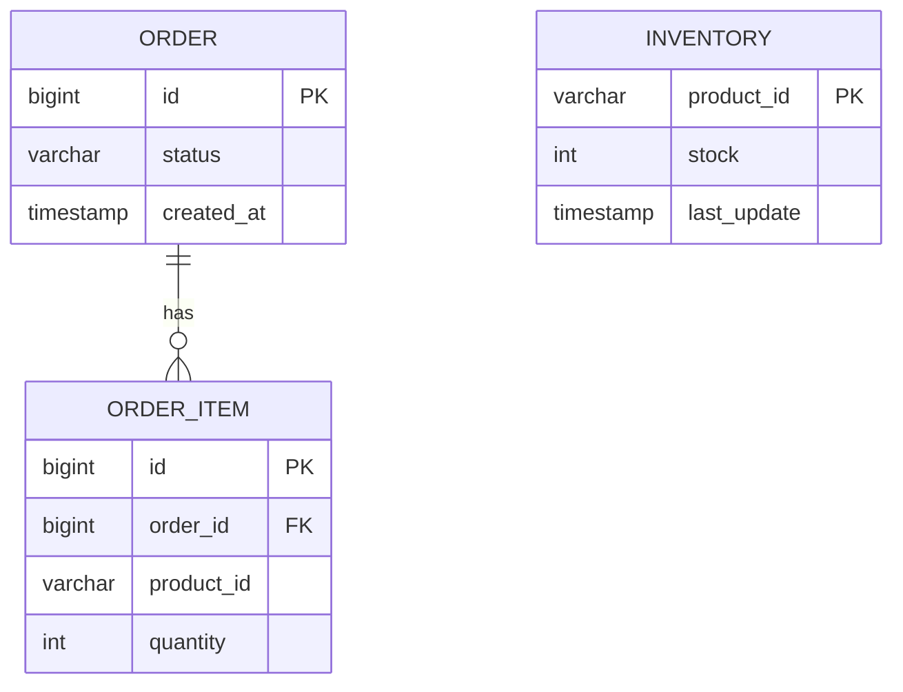

**Key data models:**

* **Order Service** maintains orders and items across two tables.
* **Inventory Service** tracks product stock and updates.

---

### 3. System Flow (Use Cases and Testing)
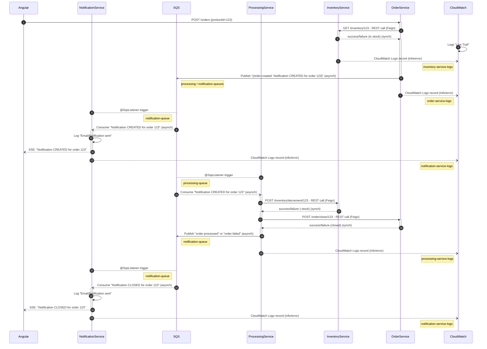

---

**Use Cases - What’s happening:**

1. **POST /orders/{productId=123}** – Angular/Postman calls OrderService to create a new order

2. **GET /inventory/123 REST call (Feign)** – OrderService calls InventoryService to check items out of stock

3. **success/failure (in stock) (synch)** – InventoryService returns inventory value so OrderService can continue

4. **Logs "Live Trail"** – Meanwhile CloudWatch is configured to receive logs from any microservice

5. **CloudWatch Logs record (info/error)** – InventoryService sends any logs to **"inventory-service-logs"** in AWS CloudWatch

6. **Publish "{order-created: Notification CREATED for order 123}" (asynch)** – OrderService writes an order to its database and sends a message to **"notification-queue"** AWS SQS

7. **CloudWatch Logs record (info/error)** – OrderService sends any logs to **"order-service-logs"** in AWS CloudWatch

8. **@SqsListener trigger** – NotificationService is also active polling any SQS messages from **"notification-queue"** in AWS SQS

9. **Consume "Notification CREATED for order 123" (asynch)** – NotificationService identifies a new order creation

10. **Log "Email/Notification"** – NotificationService simulate message broadcast by logging it to its terminal which shows in **"notification-service-logs"** at AWS CloudWatch

11. **SSE: "Notification CREATED for order 123"** – NotificationService can also provice REST port SSE allowing Dual Protocol Support

12. **CloudWatch Logs record (info/error)** – NotificationService also sends any logs to **"notification-service-logs"** in AWS CloudWatch

13. **@SqsListener trigger** – ProcessingService is also active polling any SQS messages from **"notification-queue"** in AWS SQS

14. **Consume "Notification CREATED for order 123" (asynch)** – ProcessingService identifies a new order creation

15. **POST /inventory/decrement/123 - REST call (Feign)** – ProcessingService calls InventoryService to handle items stock changes

16. **success/failure (in stock) (synch)** – InventoryService returns new inventory value so ProcessingService can continue

17. **POST /order/close/123 - REST call (Feign)** – ProcessingService calls OrderService to handle order finalization

18. **success/failure (close) (synch)** – OrderService returns updated order id so ProcessingService can continue

19. **Publish "order-processed or order-failed" (asynch)** – ProcessingService updates an order to its database and sends a message to **"processing-queue"** in AWS SQS

20. **CloudWatch Logs record (info/error)** – ProcessingService also sends any logs to **"processing-service-logs"** in AWS CloudWatch

21. **@SqsListener trigger** – NotificationService is also active polling any SQS messages from **"processing-queue"** in AWS SQS

22. **Consume "Notification CLOSED for order 123" (asynch)** – NotificationService identifies the order finalization

23. **Log "Email/Notification"** – NotificationService simulate message broadcast by logging it to its terminal which shows in **"notification-service-logs"** at AWS CloudWatch

24. **SSE: "Notification CLOSED for order 123"** – NotificationService can also provice REST port SSE allowing Dual Protocol Support

25. **CloudWatch Logs record (info/error)** – NotificationService also sends any logs to **"notification-service-logs"** in AWS CloudWatch

---

**Test Cases - Success & Fail:**

* **DB checking: Already created some order items:**
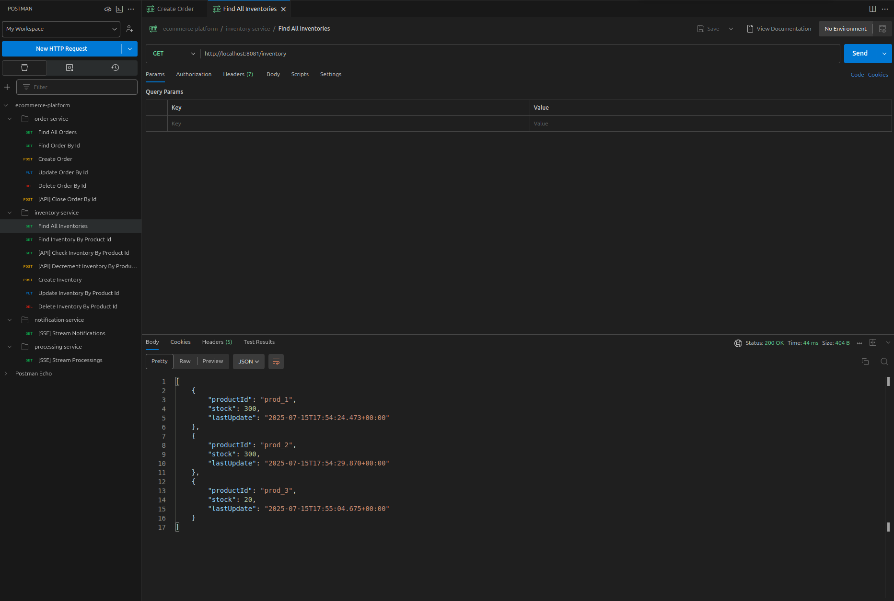

* **DB checking: Create Order with some items:**
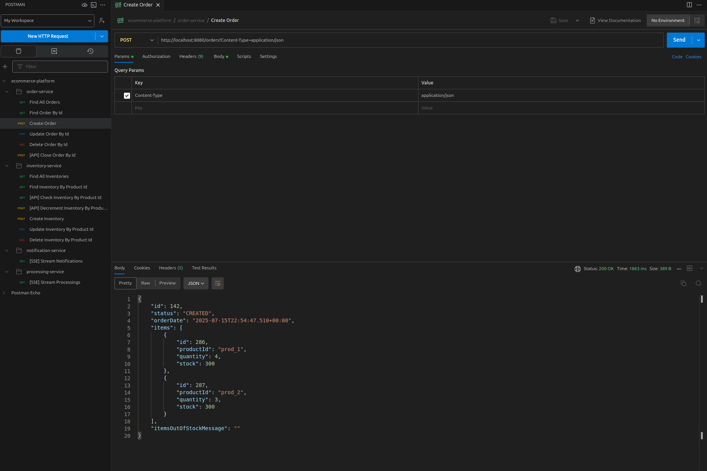

* **Publish create-order event to AWS SQS (notification-queue):**
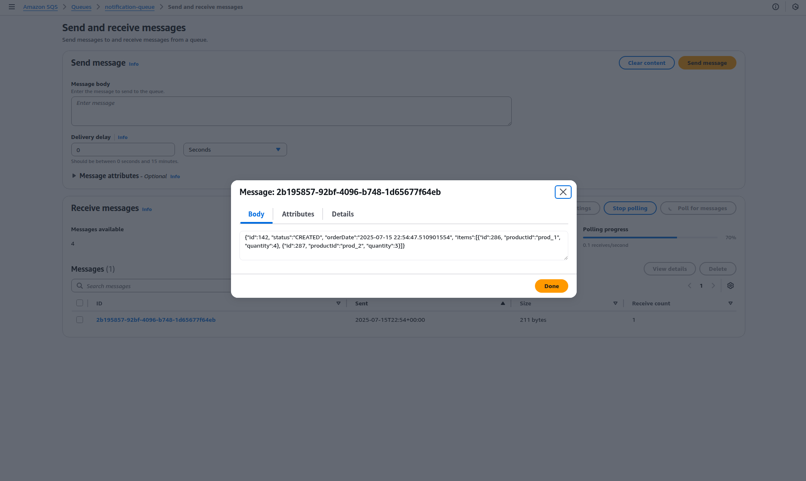

* **Publish create-order event to AWS SQS (processing-queue):**


* **Feign Api calls in CloudWatch (inventory-service-logs):**
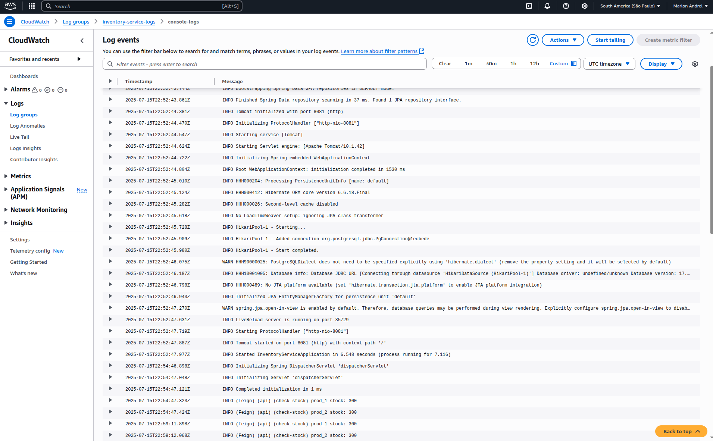

* **Publish to processing-queue event in CloudWatch (order-service-logs):**
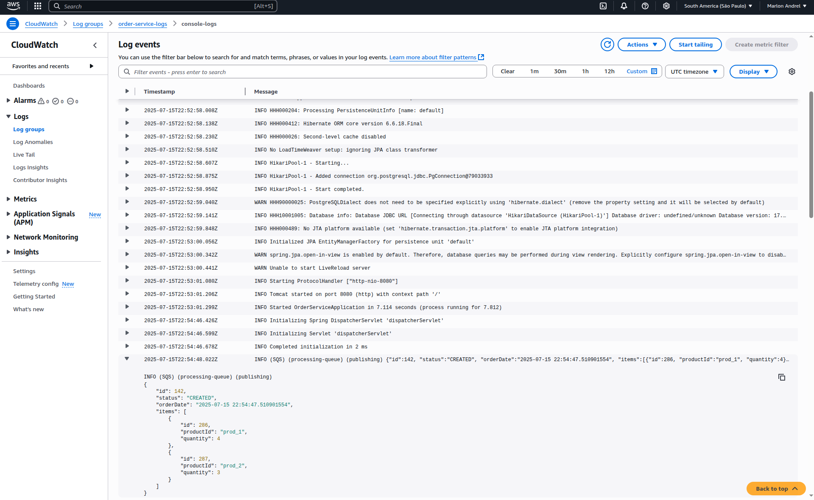

* **publish to notification-queue event in CloudWatch (order-service-logs):**
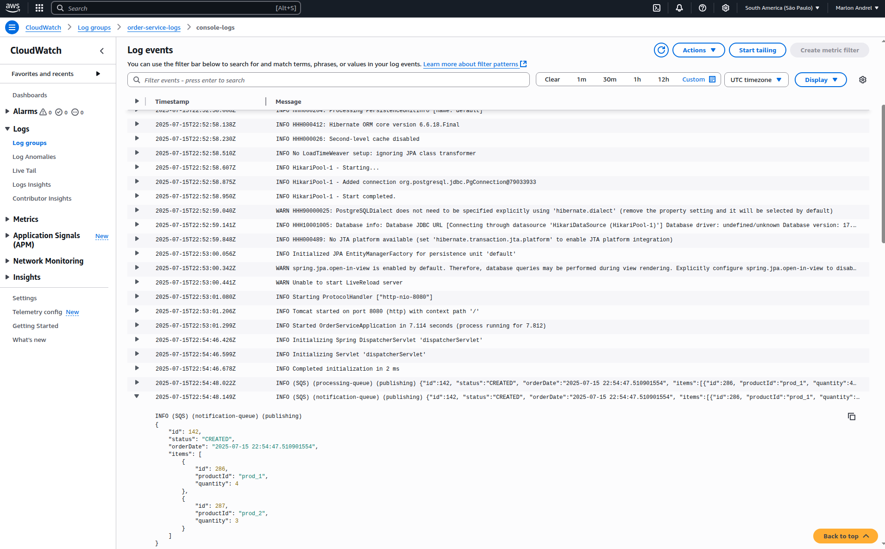

* **Consuming create-order event from processing-queue in CloudWatch (processing-service-logs):**
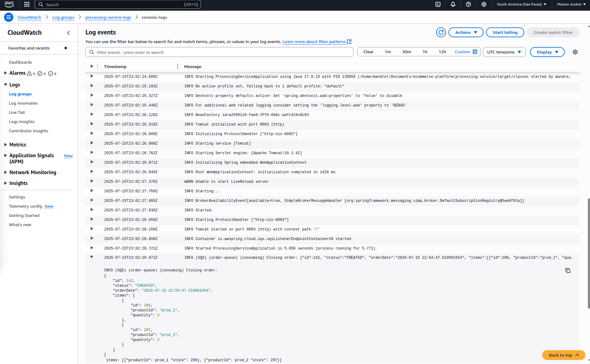

* **Publish to notification-queue in CloudWatch (processing-service-logs):**
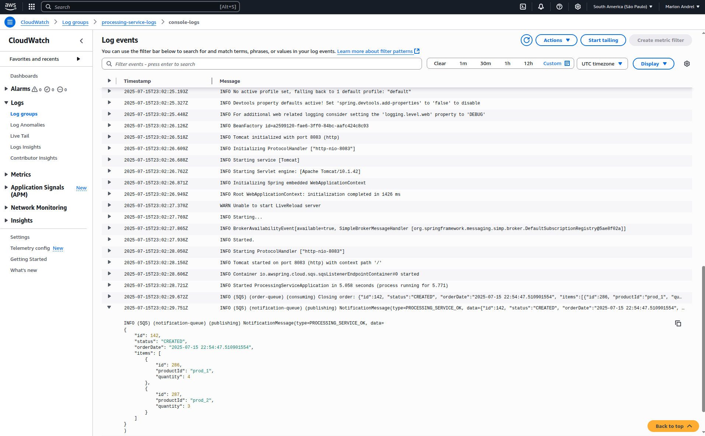

* **Consuming create-order event from notification-queue in CloudWatch (notification-service-logs):**
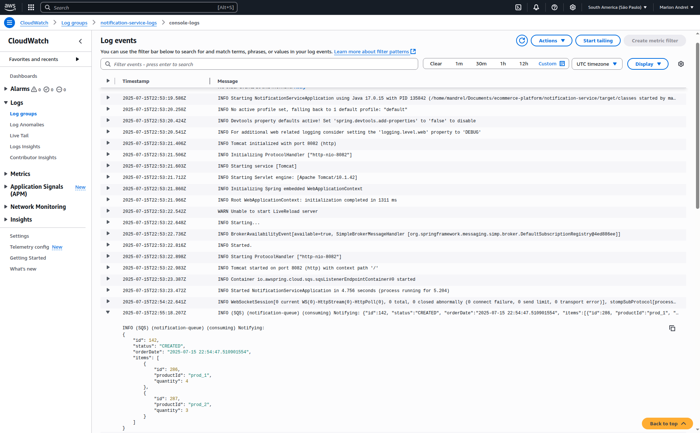

* **Consuming processing-order event from notification-queue in CloudWatch (notification-service-logs):**
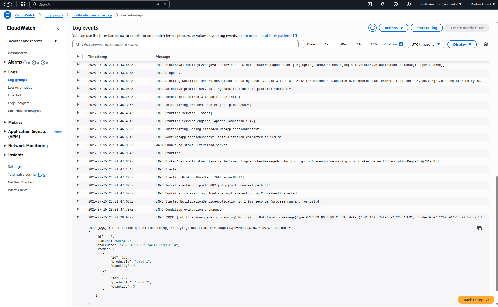

* **DB checking: Get order by id is updated:**
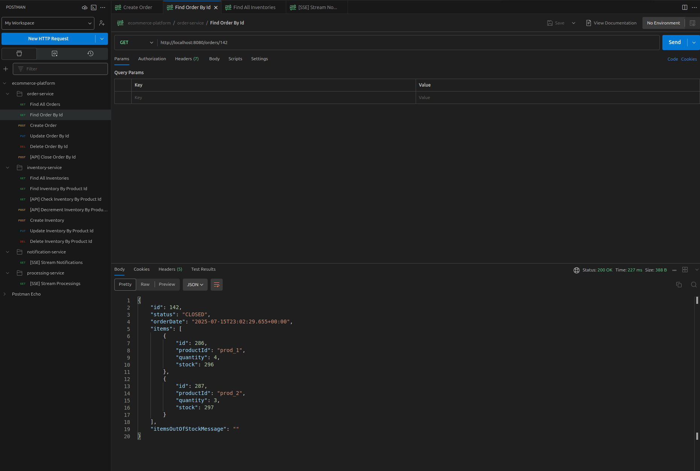

* **DB checking: Get order-items stock is updated:**
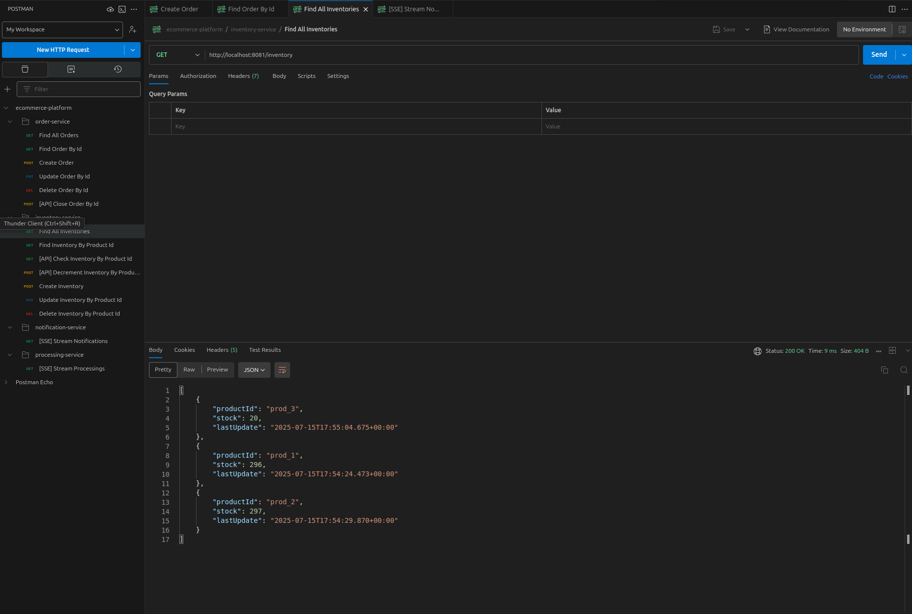

* **Bonus: (SSE) Server-Sent Events stream emitter endpoint in notification-service project:**
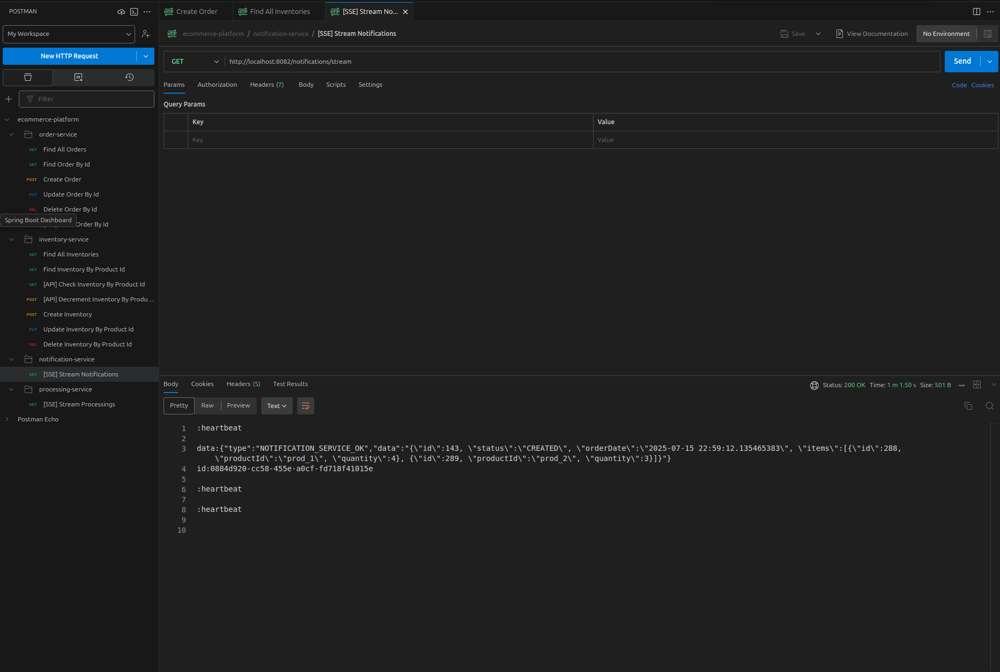

---